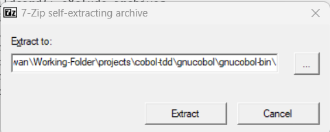

# Installation Instructions
### Windows
- Run _**windows-install.bat**_ to extract the files
- Press the "Extract" button to accept the install path


- Open the system environment variables and add the following:
COB_CONFIG_DIRECTORY <path to extracted files>\vbisam\config
COB_COPY_DIR <path to extracted files>\vbisam\copy
COB_LIBRARY_PATH <path to extracted files>\vbisam

## Linux
- Run the _**linux-install.bat**_ to extract the files
- Switch to the gnucobol folder: ```cd gnucobol```
- Execute the following commands:
```
sudo dpkg -i *.deb
sudo apt update 
sudo apt upgrade
sudo apt install clang --install-suggests
cobc -x -Xref -ftsymbols -Tvarrec.lst varrec.cbl
./varrec
```

